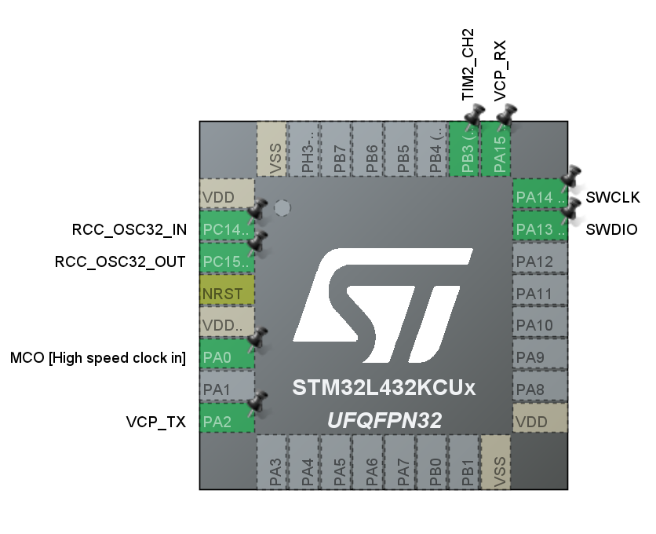
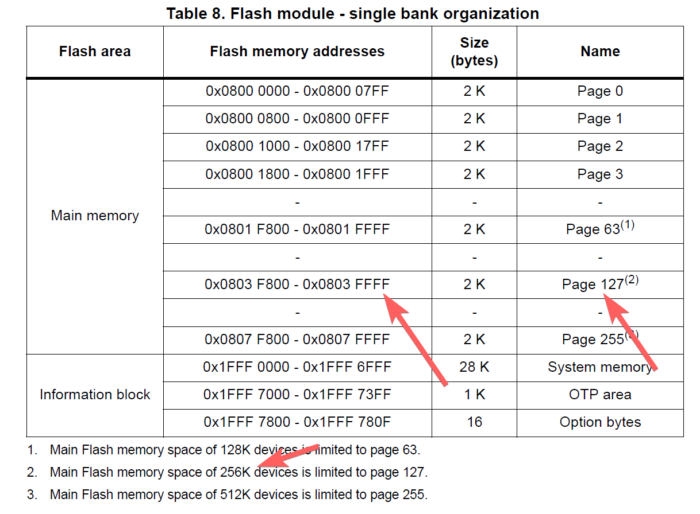
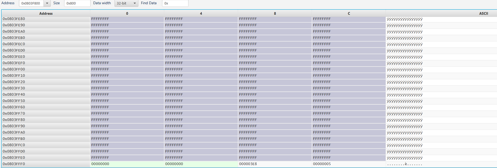

[](https://github.com/jasonyang-ee/STM32-FLASH/actions/workflows/build-all.yml)

# STM32 Flash Memory Access

## Hardware Basics

Project Using STM32L432KC as Example. Test hardware is NUCLEO-L432KC.

STM32CubeMX File Included.

Hardware using jumper pin only to test out all functionalities.


## Build This Project

More Docker Details: https://github.com/jasonyang-ee/STM32-Dockerfile

- Docker Build
```
docker run -v "{Your_Local_Full_Path}":"/home" jasonyangee/stm32_ubuntu:latest https://github.com/jasonyang-ee/STM32G431KB
```
> Visit Here for More Details: https://github.com/jasonyang-ee/STM32-Dockerfile


- Manual Build
```
cmake -B build -G Ninja
cmake --build build
```


## Pin Map

Use /CubeMX/CubeMX.ioc for complete info





## Folder Structure

This project uses HAL. Code generation using CubeMX, and the generated code structure is untouched for `/Core` `/Driver` `/Middlewares`.

The only modification is that `main.c` and `main.h` are moved into `/Application` for better workflow.

The c++ layer is done in `/Application`. All c++ class object are to represent each device or feature. Then, all objects are decleared globally in `Instances.hpp`. This will allow controlling class (State Machine or FreeRTOS) to easily access those instances and mutate data.


## Interface

Serial COM running UART at 115200 bps is the base of all debugging and user interface for this project. It is used in interrupt mode only. DMA is not necessary because of my string buffer.

On top, there is a Command Line Interface, CLI, used to interact with the application.

Send `help` in uart (via ST-Link VCP UART) to get application menu.

LED is the 2nd debugging interface. Running it in breathing / blink / rapid mode will help you to determine if system is at fault. And it is fun to stare at LED anyway.
 


## Flash

The goal is to save and load user configurations for application. Writting from the back of the flash memory.

Porting to different hardware requires user to edit `Flash.hpp` and `Flash.cpp`

Refer to the Reference Manual and find out the end of flash address. Then, update those two variable.

```c++
// L432KC has 256Kb of flash
// Same as (0x0803FFFF + 1 - 0x8); if using datasheet provided value
const uint32_t m_address_end{0x08040000 - 0x8};
const uint8_t m_page_total{127};
```




The configuration data are packaged into a struct and union aligned to `uint64_t array` for double word HAL flash writing function. The pack and unpack is done manually by user.

You will need to edit this section to fit your application needs.

```c++
// Edit config_arr_size and Config content.
#define config_arr_size 2
union Config_Arr {
	struct Config {
		uint32_t led_level;
		uint32_t led_scale;
	} config;

	uint64_t config_arr[config_arr_size];
};
```

In the public function `Save()` and `Load()`, you will need to manually pack and unpack your configuration to/from each of your instances.

Then, you will call the private function `Write()` and `Read()` to do flash access.

Below example saves and loads two configuration from LED usage.

```c++
void Flash::Save() {
    Flash::Config_Arr current_config{};
    current_config.config.led_level = led_user.getLevel();
    current_config.config.led_scale = led_user.getScale();
    Write(current_config.config_arr, config_arr_size);
}

void Flash::Load() {
    Flash::Config_Arr loaded_config{};
    Read(&loaded_config, config_arr_size);
	led_user.setLevel(loaded_config.config.led_level);
    led_user.setScale(loaded_config.config.led_scale);
}
```

The memory save example:

